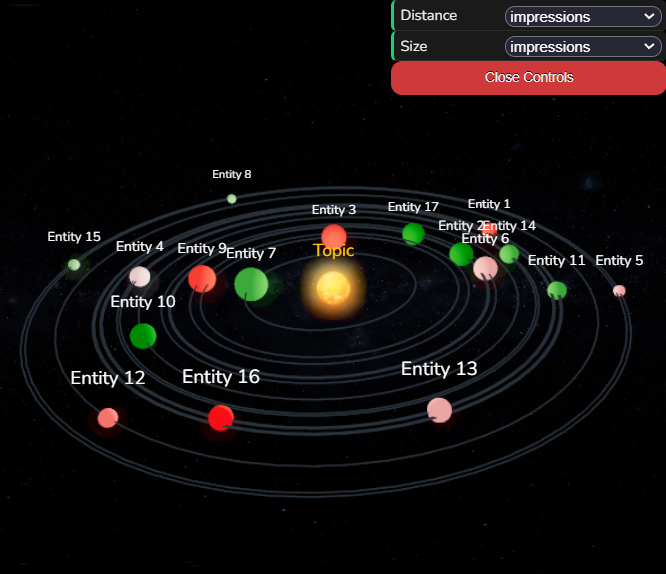

# 3D-React-Visualization-Tool
 ## 3D React Visualization Tool using Three.js

 

1. Open your terminal and then type `$ git clone {the url to the GitHub repo}` to clone the repo

2. cd into the new folder and type `$ npm install` to install the required dependencies

3. To run the React project type `$ npm start`

